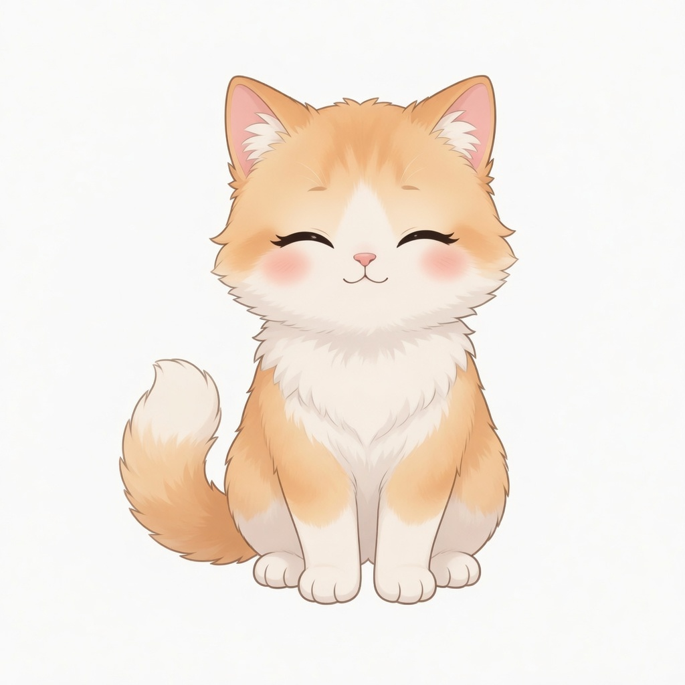

# @falser101/mascot

[中文](README.md) | [English](README.en.md)

A floating companion for the DeepSeek Harness web GUI (`dsh web`). A draggable cartoon cat or dog sits on the UI, changes expression with the current session, and chats in short lines. Drag it, click it, or double-click to tuck it away. Skins live on their own **Companion** settings page, picked from a thumbnail grid.

[▶ Watch the demo](demo/mascot-interactions.mp4)

<video src="demo/mascot-interactions.mp4" width="800" controls muted loop playsinline poster="demo/mascot-interactions.jpg">
  <a href="demo/mascot-interactions.mp4">Demo video</a>
</video>

## Looks

Open Settings → **Companion** and tap a breed. The choice is remembered locally.

### Cats

| Orange | Ragdoll | Maine Coon | Golden shaded | Silver shaded |
|:---:|:---:|:---:|:---:|:---:|
|  |  |  |  |  |

### Dogs

| Cream | Poodle | Border Collie | Corgi | Shiba |
|:---:|:---:|:---:|:---:|:---:|
|  |  |  |  |  |

### Expressions

Same character, same pose — only the face changes. The orange cat as an example:

| Neutral | Happy | Thinking | Sad | Blink |
|:---:|:---:|:---:|:---:|:---:|
|  |  |  |  |  |

It blinks while idle. Whole-body motion kicks in for thinking, tool calls, streaming, done, and errors.

## Features

- **Session-aware.** Queued, waiting for you, thinking, calling a tool, writing, done, or errored — each has its own face and line. Display-only: it never emits session events.
- **Draggable.** Position is saved; a resize clamps it back into the viewport.
- **Status bubble.** Stays up while the agent is busy. While idle it can pop on a quiet / standard / lively cadence, or only on hover.
- **AI vignettes.** About one in five idle lines can come from the already-configured default model. Missing keys or a failed call fall back to the built-in pool.
- **Hover comfort.** The bubble switches to a softer line, e.g. “Hold on, I am thinking hard.”
- **Parallel work.** A badge appears when several sessions or sub-agents are running. Hover for the list; click a row to jump there.
- **Click / double-click.** A click draws a playful line. Double-click collapses it to a dot; double-click again to bring it back.
- Copy follows the UI language (Chinese / English). Motion stops when the system asks for reduced motion.

## Moods

| Mood | When | What you see |
| --- | --- | --- |
| Idle | Nothing running | Breathe + blink, “Here whenever you need me～” |
| Queued | Message sent, not started | A hop, “Got it! Joining the queue” |
| Confirming | Approval or a question waiting | Head tilt, “Waiting for your approval～” |
| Thinking | Running, no output yet | Thoughtful, “Let me think…” |
| Working | A tool is running | A sway, “Running 「{tool}」” |
| Streaming | Answer tokens arriving | “Writing the answer…” |
| Done | Turn just finished (~4 s) | A cheer, “Done! 🎉” |
| Error | Turn failed | A shake, “Oops, something went wrong…” |
| Greeting | You just switched sessions (~4 s) | “Hi there!” |

## Install

You need a DeepSeek Harness that can run `dsh --profile web` (`@deepseek-ai/dsh-client-*` ≥ `0.1.0-rc.5`).

Add it to the web profile with the official command:

```sh
dsh plugin --profile web add github:falser101/dsh-mascot
```

After the npm release:

```sh
dsh plugin --profile web add @falser101/mascot
```

Restart `dsh --profile web`. The companion appears in the lower-right corner; Settings gains a **Companion** page.

For a local checkout:

```sh
dsh plugin --profile web add /path/to/dsh-mascot
```

Remove it with:

```sh
dsh plugin --profile web remove @falser101/mascot
```

## Develop

```sh
pnpm build        # emit lib/ (host half + browser bundle)
pnpm watch        # hot-reload the client half
pnpm test
```

`lib/` is committed, so git and npm installs need no extra build step.

To swap art: overwrite the same-named jpgs under `docs/<breed>/` → `node scripts/build-art-assets.mjs` → rebuild. Prompt pack: [`docs/character-art-prompts.md`](docs/character-art-prompts.md).

## License

MIT
