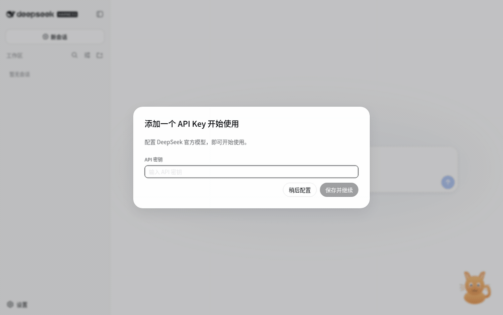

# @falser101/mascot

一个为 DeepSeek Harness Web GUI（`dsh web`）设计的**悬浮伙伴插件**：一只可拖动、会动的卡通猫/狗悬浮在界面上，根据当前会话的活动状态展示不同的表情动画和文字气泡，支持悬停互动、点击互动、双击收起/唤出，并可在设置页切换形象。

A draggable animated floating companion for the DeepSeek Harness web GUI (`dsh web`). It reacts to the current session's activity with mood-specific animations and speech bubbles, supports drag / hover / click / double-click interactions, and offers a cat/dog skin switcher in General settings.

## 功能特性

- **状态反应**（全部来自当前会话快照，纯前端展示，不发任何会话事件）：
  | 状态 | 触发 | 动画与文案 |
  |---|---|---|
  | idle 空闲 | 无活动 | 呼吸 + 眨眼，「我在呢，随时找我～」 |
  | queued 排队 | 消息已发出、尚未开始 | 雀跃弹跳，「收到！排队开工」 |
  | confirming 等待确认 | 审批 / 提问待响应 | 歪头，「等你批准一下～」/「有件事想问你～」 |
  | thinking 思考 | 运行中、无输出 | 歪头沉思 + 眯眼，「让我想想…」 |
  | working 干活 | 正在调用工具 | 忙碌摇晃 + 冒汗滴，「正在调用「{工具名}」」 |
  | streaming 写答案 | 流式输出中 | 眼睛扫动，「在写答案…」（狗狗会吐舌） |
  | done 完成 | 回合结束（4 秒瞬态） | 欢呼弹跳 + 星星，「搞定啦！🎉」 |
  | error 出错 | 回合出错 | 发抖 + 泪滴，「哎呀，出错了…」 |
  | greeting 打招呼 | 切换会话（4 秒瞬态） | 摇尾巴（狗狗甩耳），「你好呀！」 |
- **拖拽**：全屏可拖，松手后位置存入 localStorage，刷新不丢；窗口缩放自动夹回视口内。
- **常显气泡**：AI 忙碌时（排队 / 等待确认 / 思考 / 调工具 / 写答案 / 出错）气泡自动显示，不悬停也能看到它在忙什么；忙碌中气泡右上角有三个跳动的小点。可在设置页关闭。
- **悬停安慰**：鼠标放上去，气泡文字切换成温柔陪伴风——思考中「别着急，我在努力想～」、调工具「马上就好！」、出错「抱抱，别难过，我们再试一次」；空闲时悬停会随机说小剧场台词。
- **点击**：随机说一句俏皮话。
- **双击**：收起成小圆点 / 唤出。
- **形象切换**：设置页 → 通用 → 「悬浮伙伴形象」选择猫咪/狗狗，选择持久化。
- 中英双语文案（跟随界面语言）；尊重 `prefers-reduced-motion`（系统减弱动态时动画关闭）。

## 效果演示



上图录制于无 key 的干净实例：悬停安慰文案 → 点击俏皮话 → 拖拽移动 → 设置切换皮肤。会话状态类动画与常显气泡（思考/调工具/完成等）需要真实对话触发，见下文"状态反应"表。

## 安装（给使用者）

前置条件：一台已装好 DeepSeek Harness 并能运行 `dsh --profile web` 的机器（仓库内各 `@deepseek-ai/dsh-client-*` 依赖版本 ≥ `0.1.0-rc.5`）。

### 方式一：profile patch（最简单，本机试用）

1. 把本包放到任意位置（例如 `~/dsh-plugins/@falser101/mascot`），并让行名可被解析：
   ```sh
   mkdir -p ~/.dsh/profiles/node_modules/@falser101
   ln -s /path/to/this/package ~/.dsh/profiles/node_modules/@falser101/mascot
   ```
   （`$DSH_HOME/profiles/node_modules` 是 dsh 维护的扁平回退目录，解析器会按普通 Node 规则找到它。）
2. 编辑 `~/.dsh/profiles/web/cordis.patch.yml`，追加：
   ```yaml
   - insert:
       - id: ui-mascot
         name: '@falser101/mascot'
   ```
3. 重启 `dsh --profile web`，打开页面即可看到右下角的悬浮伙伴。

### 方式二：作为 bundle 依赖（正式分发）

1. 在 profile 的 `package.json`（`~/.dsh/profiles/web/package.json`）中加入依赖与 bundle 层：
   ```json
   {
     "dependencies": { "@falser101/mascot": "git+https://<你的仓库地址>.git" },
     "dsh": { "profile": { "bundles": ["@deepseek-ai/dsh-base", "@deepseek-ai/dsh-web-app", "@falser101/mascot"] } }
   }
   ```
   （bundle 自带的 `cordis.patch.yml` 会插入 `ui-mascot` 行，无需手改 patch。）
2. 在 profile 目录执行 `pnpm install`，重启 `dsh --profile web`。

卸载：删除 patch 行（或 bundle 层）并重启即可；客户端插件缓存仅在进程重启时刷新。

## 开发

```sh
pnpm build        # tsc 类型构建 + tsdown 产出 lib/（node 半区 + 浏览器 bundle）
pnpm watch        # tsdown 监听重建（dsh web 的 webserver 会自动感知 lib/client.js 变化并热重载页面）
pnpm typecheck
pnpm test         # vitest（35 个用例：状态机折叠 / store 持久化 / 组件交互 / 插件装配与卸载）
```

构建产物 `lib/` 已随仓库提交：git 依赖安装（方式二）无需任何构建工具。

开发期类型与测试解析依赖 Harness 仓库源码（`tsconfig.base.json` 的 paths），当前通过 `vitest.config.ts` / `tsconfig.json` 中的绝对路径指向本机 checkout；分发产物不依赖该路径。

## 自定义形象

角色皮肤是自包含的 SVG 组件（`src/client/character/`）：

- **分层 SVG（推荐）**：身体/头/耳朵/眼睛/嘴/尾巴等部件各自成 `<g>` 或元素，通过 `data-mood` / `data-dragging` 属性驱动的 CSS 逐部件动画（眨眼、摇尾、歪头、冒汗、泪滴、星星）。按 `CatSkin` 的部件契约（`body/head/earL/earR/eyeL/eyeR/mouth/tail` 等 class）绘制即可无缝接入。
- **单张 PNG**：只能整体动画（弹跳/摇晃/缩放），把图片作为 `<image>` 嵌入 SVG 根即可。

新皮肤在 `skins.ts` 的 `SKINS` 列表登记后自动出现在设置页选择器中；`SkinId` 联合类型同步扩展。

## 工作原理

- 挂载点：`shell.overlay`（ui-layout 声明的全应用悬浮层，点击穿透由宿主保证，条目自行 opt-in）。
- 数据：`MascotSource` 订阅 `ctx.sessions.list`（当前会话）与当前会话的 `ConversationSnapshot`（快照含 `queue/running/partial/runningCalls/turnEnds/lastAgentError/pending`），折叠为 mood 帧，通过 register 的 inject `hooks` 通道绑定为组件里的 `useMascot()`。**纯展示投影**：不发 session 事件、不触达模型，回放任何快照序列都确定性收敛。
- 状态：`defineStore` 单一句柄同时传给悬浮条目与设置行（root 作用域共享实例），`persist: 'dsh-client-ui-mascot'` 自动落 localStorage。
- 生命周期：所有订阅/注册都在 `ctx.effect` 作用域内，插件卸载（含 HMR）全部回收；`browser-plugin` 测试覆盖该卸载路径。
- 浏览器 bundle 的共享平台模块（react、cordis、ui-slots、ui-primitives、runtime/client 等）全部 external，由宿主 shell 的模块表提供，本包运行时零 npm 依赖。

## License

MIT
